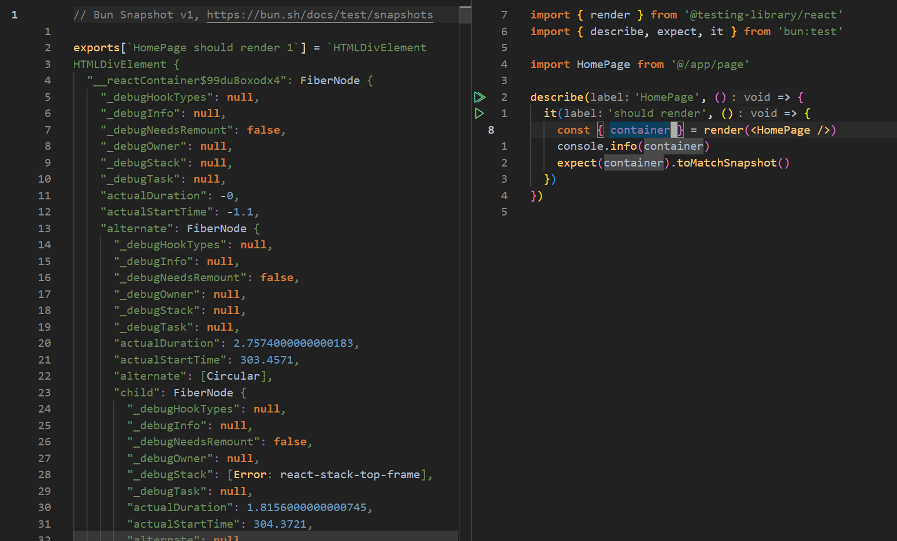
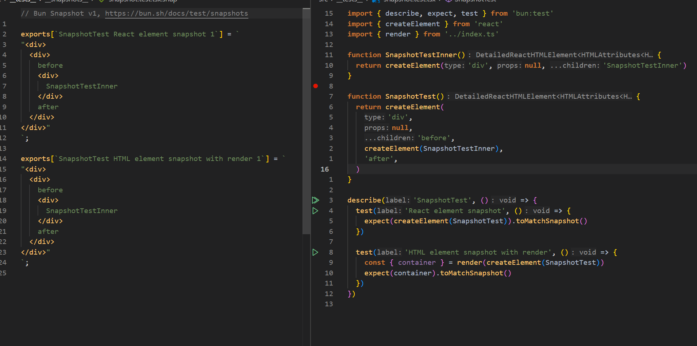

# bun-test-env-dom

A preload library for Bun that provides a ready-to-use DOM environment for testing. It automatically sets up [happy-dom](https://github.com/capricorn86/happy-dom) and enables proper snapshot testing for React and HTML elements with beautifully formatted output.

## Why?

Without this library, Bun's snapshot testing outputs unreadable React internals (FiberNode, stateNode, etc.):



With `bun-test-env-dom`, snapshots are clean, formatted HTML that's easy to read and review:



## Installation

```bash
bun add -d bun-test-env-dom
```

## Setup

Add the following to your `bunfig.toml`:

```toml
[test]
preload = ["bun-test-env-dom"]
```

That's it! The DOM environment is automatically configured when tests run.

## Features

### Snapshot Testing for React & HTML Elements

Snapshot testing works seamlessly with both React elements and HTML elements. The HTML output is automatically formatted for readable snapshots.

```tsx
import { expect, test } from 'bun:test'
import { render } from 'bun-test-env-dom'

test('React element snapshot', () => {
  expect(<Component />).toMatchSnapshot()
})

test('HTML element snapshot', () => {
  const { container } = render(<Component />)
  expect(container).toMatchSnapshot()
})
```

### Re-exported @testing-library/react

All functions from `@testing-library/react` and `@testing-library/user-event` are re-exported, so you can import directly from `bun-test-env-dom`:

```tsx
import { render, screen, fireEvent } from 'bun-test-env-dom'

describe('HomePage', () => {
  it('should render', () => {
    const { container } = render(<HomePage />)
    expect(container).toMatchSnapshot()
  })
})
```

### Full TypeScript Support for Custom Matchers

All additional matchers from `@testing-library/jest-dom` are fully typed:

```tsx
import { expect, test } from 'bun:test'
import { render } from 'bun-test-env-dom'

test('custom matchers', () => {
  const { getByRole } = render(<Button pressed>Click me</Button>)

  expect(getByRole('button')).toBePressed()
  expect(getByRole('button')).toBeVisible()
  expect(getByRole('button')).toHaveTextContent('Click me')
})
```

## License

Apache-2.0
