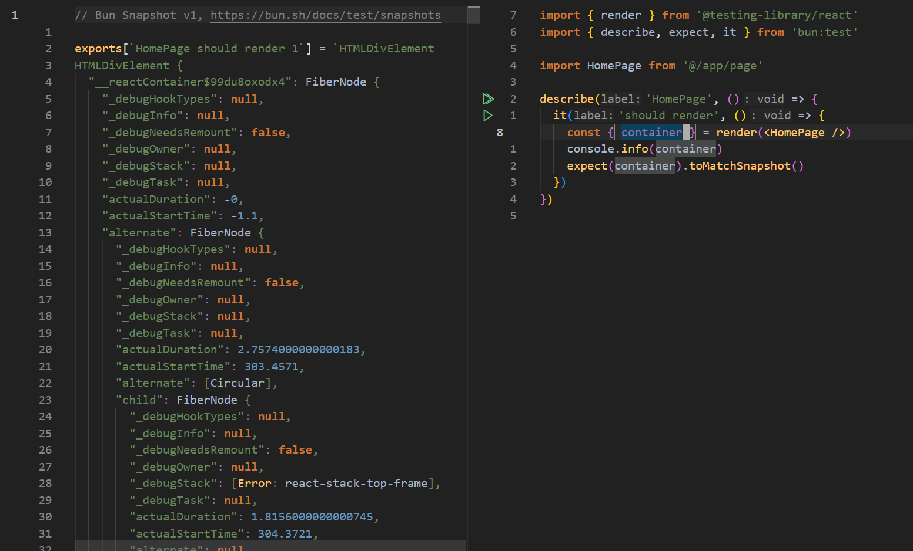
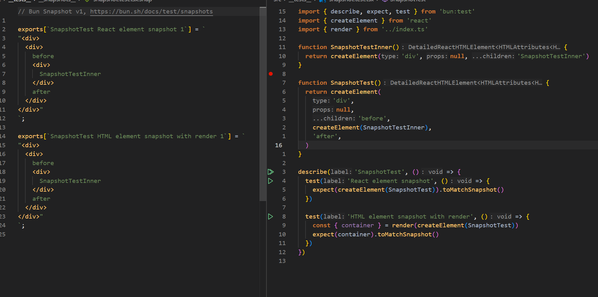

# bun-test-env-dom

A preload library for Bun that provides a ready-to-use DOM environment for testing. It automatically sets up [happy-dom](https://github.com/capricorn86/happy-dom) and enables proper snapshot testing for React and HTML elements with beautifully formatted output.

## Why?

Without this library, Bun's snapshot testing outputs unreadable React internals (FiberNode, stateNode, etc.):



With `bun-test-env-dom`, snapshots are clean, formatted HTML that's easy to read and review:



## Installation

```bash
bun add -d bun-test-env-dom
```

## Setup

Add the following to your `bunfig.toml`:

```toml
[test]
preload = ["bun-test-env-dom"]
```

That's it! The DOM environment is automatically configured when tests run.

## Features

### Snapshot Testing for React & HTML Elements

Snapshot testing works seamlessly with both React elements and HTML elements. The HTML output is automatically formatted for readable snapshots.

```tsx
import { expect, test } from 'bun:test'
import { render } from 'bun-test-env-dom'

test('React element snapshot', () => {
  expect(<Component />).toMatchSnapshot()
})

test('HTML element snapshot', () => {
  const { container } = render(<Component />)
  expect(container).toMatchSnapshot()
})
```

### Re-exported @testing-library/react

All functions from `@testing-library/react` and `@testing-library/user-event` are re-exported, so you can import directly from `bun-test-env-dom`:

```tsx
import { render, screen, fireEvent } from 'bun-test-env-dom'

describe('HomePage', () => {
  it('should render', () => {
    const { container } = render(<HomePage />)
    expect(container).toMatchSnapshot()
  })
})
```

### Full TypeScript Support for Custom Matchers

All additional matchers from `@testing-library/jest-dom` are fully typed:

```tsx
import { expect, test } from 'bun:test'
import { render } from 'bun-test-env-dom'

test('custom matchers', () => {
  const { getByRole } = render(<Button pressed>Click me</Button>)

  expect(getByRole('button')).toBePressed()
  expect(getByRole('button')).toBeVisible()
  expect(getByRole('button')).toHaveTextContent('Click me')
})
```

## Next.js

`bun-test-env-dom/next` replaces every public `next/*` module with a stand-in that needs no Next.js runtime, router or compiler - Next.js does not even have to be installed. Preload it after the DOM:

```toml
[test]
preload = ["bun-test-env-dom", "bun-test-env-dom/next"]
```

Your code keeps importing from `next/*`. Tests set the page and check navigation through `bun-test-env-dom/next`:

```tsx
import { expect, test } from 'bun:test'
import { render, screen, userEvent } from 'bun-test-env-dom'
import { router, setParams, setUrl } from 'bun-test-env-dom/next'

test('opens the next post', async () => {
  setUrl('/posts/1?tab=comments')
  setParams({ id: '1' })
  render(<Post />)
  await userEvent.click(screen.getByRole('link', { name: 'Next' }))
  expect(router.push).toHaveBeenCalledWith('/posts/2', { scroll: true })
})
```

Everything below is reset before each test:

| Export | What it controls |
| --- | --- |
| `router` | What `useRouter()` from `next/navigation` returns. Its methods are mocks, and `next/link` and `next/form` navigate through them. |
| `setUrl(url)` | `usePathname()`, `useSearchParams()` and the Pages Router's URL. A relative URL resolves against the current one. |
| `setParams(params)` | `useParams()` and the Pages Router's `query`. |
| `setRoute(route)` | The Pages Router's `pathname` and `route`, like `/posts/[id]`. |
| `setSegments(segments)` | `useSelectedLayoutSegments()`, which otherwise splits the path. |
| `setHeaders(init)`, `setCookies(cookies)`, `setDraftMode(enabled)` | `headers()`, `cookies()` and `draftMode()` from `next/headers`. |
| `setOffline(offline)` | `useOffline()` from `next/offline`. |
| `setRootParams(params)` | The getters `next/root-params` exports. |
| `resetNext()` | All of the above, and every mock. |

What the stand-ins do:

- Navigation is recorded, not performed: `router.push` changes neither the URL nor what is rendered. Clicking a `next/link`, or submitting a `next/form` with a string `action`, calls `router.push` (or `replace`) wherever Next.js would navigate client-side. Modified clicks, other targets, downloads and other origins are left to the browser.
- `next/link`, `next/image`, `next/form` and `next/error` render the same markup as Next.js 16, so snapshots survive a change of framework underneath. `next/image` renders images as `unoptimized`: never through `/_next/image`.
- `redirect`, `notFound`, `forbidden` and `unauthorized` throw errors with the `digest` Next.js gives them.
- `next/script` renders nothing and never loads a script. `next/dynamic` is `React.lazy`: wait for it with `findBy*`.
- `next/font` returns stable class names: `Inter()` has the class `__className_inter`.
- `next/cache` functions are mocks, and `unstable_cache` caches nothing.
- `NextRequest` and `NextResponse` from `next/server` keep the `cookie` and `set-cookie` headers that happy-dom's `Request` and `Response` drop.
- `next/router` is the Pages Router, with mock methods. `next/compat/router` returns `null`, as in the App Router, until `setRoute` is called.
- `next/root-params` exports the names given to `setRootParams`. A module's imports are linked when it loads, so for a module that imports them statically, call `setRootParams` in a preload.

## License

Apache-2.0
